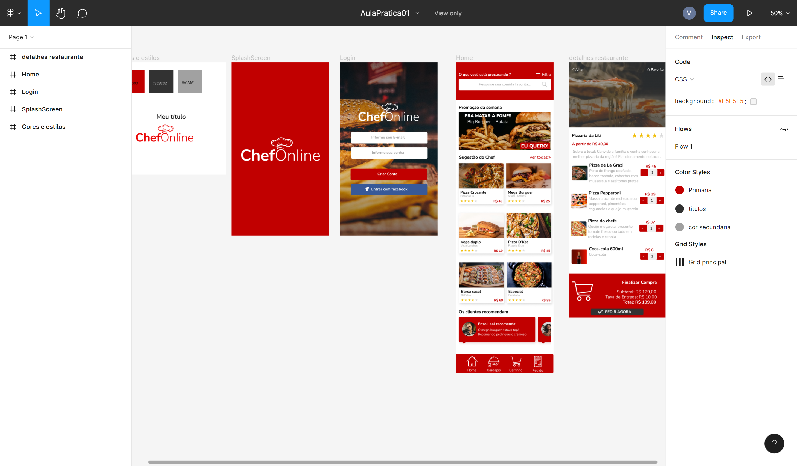

# Aula Figma Cursae

> Projeto desenvolvido para aprendizado na plataforma do Cursae. 

* Desing com Figma - Construindo layout de um app de pedido de alimentos fast food. 

[ 📎 Clique aqui para acessar] (https://www.figma.com/file/2KAqcwkO6BrVPYHw8W5tCd/AulaPratica01?node-id=0%3A1)

